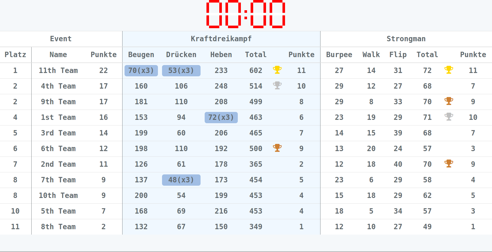
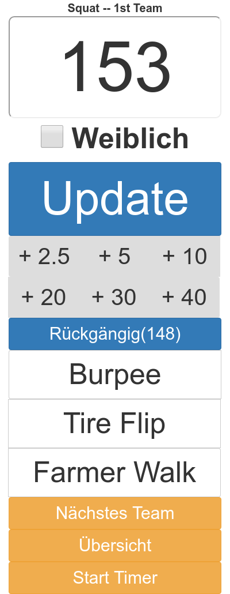

# Bergfest Games Tracking

This application lets you track the lifts of the 2017 Bergfest Games. Using [Laravel](https://laravel.com) we provide a server instance to which clients can connect.

There are two kinds of views available:

* The current standings, to be displayed on a big screen 
  
  
* The judges view, where judges can add the current lifts valid lifts (either by the total weight or count up the repetitions depending on the type of lift).

  

## Setup

Clone this repository, and install the [node package manager](http://npmjs.com/) as well as [composer](https://getcomposer.org/). 
We also require a PHP version that can run [Laravel](https://laravel.com/) along with MySQL and the corresponding PHP 
In the root directory, run
```
composer install
npm install
npm run dev
```

To setup the databse, run
```
mysql -u root -p
# create the database 
>>> create database laravel;
# verify that the databse exists
>>> show databases;
```
Exit the mysql terminal and copy the `.env.example` file to `.env`, changing the databse settings according to your configuration. You should modify the keys `DB_DATABASE` to `laravel` and set the `DB_USERNAME` and `DB_PASSWORD` according to your mysql settings.

Now prepare the Application key:
```
php artisan key:generate
```

You can put all teams into the file `storage/data/teams`, separated by newlines. To load the teams into the databse run 
```
php artisan db:seed
```

To start the application run
```
php artisan serve --host 0.0.0.0 --port 8080
```
or setup an NGINX/XAMPP server using the `./public` directory.

